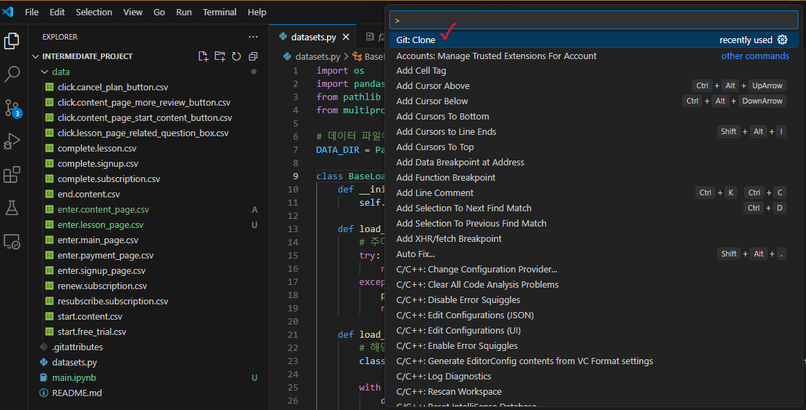
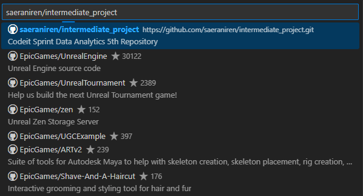
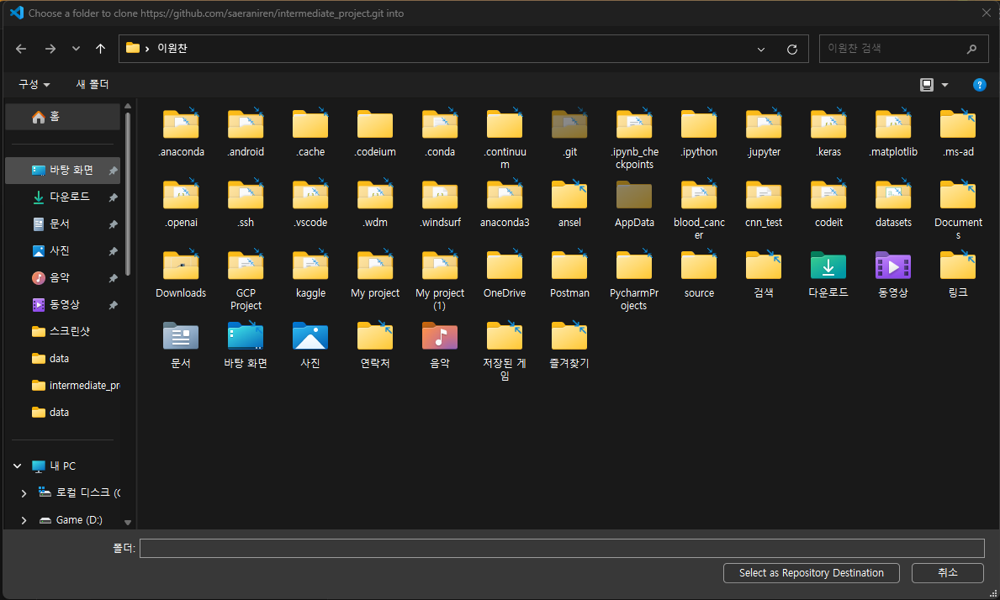

# 코드잇 스프린트 DA 5기 중급 프로젝트 Repository
**GitHub 사용 방법**

<주의사항> (내용 추가시 디스코드로 공지할 예정)
1. 현재 작업하고 계시는 폴더의 상위 폴더에 clone을 진행해주세요
2. clone시 현재 저장소에 업로도 되어 있는 모든 데이터가 복제됩니다. 
   이와 관련하여 현재 ``data`` 폴더 내 모든 파일, ``.gitattributes``, ``README.md``, ``datasets.py`` 파일은 
   초심자를 위해 **<ins>절대 수정 및 삭제는 자제 부탁드립니다.</ins>**
3. ``data`` 내 폴더에 현재 올라와있지 않은 데이터는 다음과 같습니다. 
   이 데이터만 따로 복사/붙여넣기를 진행하시고 작업해주세요.

   - ``enter.content_page.csv``
   - ``enter.lesson_page.csv``
4. 커밋 메세지는 ``작업 내용(홍길동)`` 와 같은 방식으로 입력해주시기 바랍니다.
5. 작업하신 ipynb 파일을 commit/push 시 이름은 ``영문이름_이니셜_main.ipynb``로 바꾼 후 진행해주시기 바립니다.

---

이하, GitHub사용 설명 관련입니다. 
가장 크게 사용될 내용에 대해서 다루었고, 토글 방식으로 되어 있으니 클릭해서 봐주시면 감사드리겠습니다! 
질문이 생기시면 저에게 말씀해주세요!

Git Clone 관련

1. VSCode를 킨 뒤 F1 버튼을 눌러 ``Git:Clone`` 검색 후 ``Clone from GitHub`` 실행 
 
2. ``saeraniren/intermediate_project`` 검색 
 
3. 작업 영역을 만들 곳에 ``Select as Repository Destination`` 클릭 
 

Git Commit/Push 관련

1. Clone으로 만들어진 작업 영역에서 꼭 시작하기
2. 왼쪽 사이드의 아이콘 중 위에서 3번째 아이콘 클릭
3. ``Changes`` 탭에 있는 파일 중 내가 업로드할 파일 선택 후 ``Staged Changes`` 탭에 잘 올라가져 있는지 확인
4. VSCode 최상단 ``Terminal(터미널)`` 클릭 후 ``New Terminal(새 터미널)`` 선택
5. 표시된 터미널에 ``git commit -m "상단의-예시"`` 입력 후 엔터
6. ``git push origin main`` 입력 시 GitHub 저장소에 저장 완료

## 프로젝트 주제
(공란)

## 프로젝트 시행목적

## 프로젝트 개요 및 추진방향
- (공란)
- (공란)
- (공란)

## 프로젝트팀 운영계획
- 불참해야 할 일 생길 때, 하루 전에는 팀장에게 꼭 전달하기
- 공지 확인 후에 Check 이모티콘 남겨주기
- 프로젝트 진행 중 질문이 있으면 서로 답변해주기

## 프로젝트 일정
- 중급1 프로젝트 OT: 2/17(월) 14:00 ~
- 중급1 프로젝트 기간 : OT직후 ~ 3/14(금)
- 중간 발표 : 2/28(금)
- 최종발표 : 3/13 ~ 3/14

## 프로젝트 참여 인원
팀장 및 GitHub 관리자 : 이원찬  
팀원 : 김해인, 박예나, 성유창, 오금희, 유상범, 정수민  
